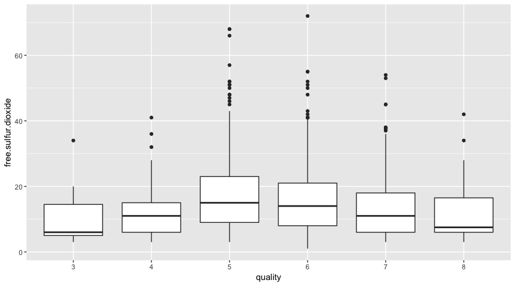
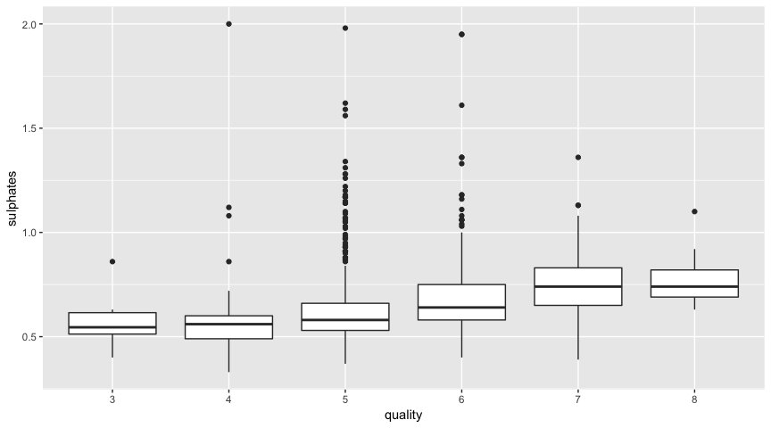

 
# Introduction

This project aims to use R and exploratory data analysis techniques to explore a public available dataset about Red Wine Quality. 
The dataset contains several physicochemical attributes from red variants of the Portuguese “Vinho Verde” wine and sensory classification made by wine experts.


# Univariate Exploration

In this section, we will first look at the structure of the data set. Then we will examine the distribution of each attribute individually by plotting its distribution.


```
## [1] 1599   12
```


```
## 'data.frame':	1599 obs. of  12 variables:
##  $ fixed.acidity       : num  7.4 7.8 7.8 11.2 7.4 7.4 7.9 7.3 7.8 7.5 ...
##  $ volatile.acidity    : num  0.7 0.88 0.76 0.28 0.7 0.66 0.6 0.65 0.58 0.5 ...
##  $ citric.acid         : num  0 0 0.04 0.56 0 0 0.06 0 0.02 0.36 ...
##  $ residual.sugar      : num  1.9 2.6 2.3 1.9 1.9 1.8 1.6 1.2 2 6.1 ...
##  $ chlorides           : num  0.076 0.098 0.092 0.075 0.076 0.075 0.069 0.065 0.073 0.071 ...
##  $ free.sulfur.dioxide : num  11 25 15 17 11 13 15 15 9 17 ...
##  $ total.sulfur.dioxide: num  34 67 54 60 34 40 59 21 18 102 ...
##  $ density             : num  0.998 0.997 0.997 0.998 0.998 ...
##  $ pH                  : num  3.51 3.2 3.26 3.16 3.51 3.51 3.3 3.39 3.36 3.35 ...
##  $ sulphates           : num  0.56 0.68 0.65 0.58 0.56 0.56 0.46 0.47 0.57 0.8 ...
##  $ alcohol             : num  9.4 9.8 9.8 9.8 9.4 9.4 9.4 10 9.5 10.5 ...
##  $ quality             : Ord.factor w/ 6 levels "3"<"4"<"5"<"6"<..: 3 3 3 4 3 3 3 5 5 3 ...
```


```
##  fixed.acidity   volatile.acidity  citric.acid    residual.sugar  
##  Min.   : 4.60   Min.   :0.1200   Min.   :0.000   Min.   : 0.900  
##  1st Qu.: 7.10   1st Qu.:0.3900   1st Qu.:0.090   1st Qu.: 1.900  
##  Median : 7.90   Median :0.5200   Median :0.260   Median : 2.200  
##  Mean   : 8.32   Mean   :0.5278   Mean   :0.271   Mean   : 2.539  
##  3rd Qu.: 9.20   3rd Qu.:0.6400   3rd Qu.:0.420   3rd Qu.: 2.600  
##  Max.   :15.90   Max.   :1.5800   Max.   :1.000   Max.   :15.500  
##    chlorides       free.sulfur.dioxide total.sulfur.dioxide
##  Min.   :0.01200   Min.   : 1.00       Min.   :  6.00      
##  1st Qu.:0.07000   1st Qu.: 7.00       1st Qu.: 22.00      
##  Median :0.07900   Median :14.00       Median : 38.00      
##  Mean   :0.08747   Mean   :15.87       Mean   : 46.47      
##  3rd Qu.:0.09000   3rd Qu.:21.00       3rd Qu.: 62.00      
##  Max.   :0.61100   Max.   :72.00       Max.   :289.00      
##     density             pH          sulphates         alcohol      quality
##  Min.   :0.9901   Min.   :2.740   Min.   :0.3300   Min.   : 8.40   3: 10  
##  1st Qu.:0.9956   1st Qu.:3.210   1st Qu.:0.5500   1st Qu.: 9.50   4: 53  
##  Median :0.9968   Median :3.310   Median :0.6200   Median :10.20   5:681  
##  Mean   :0.9967   Mean   :3.311   Mean   :0.6581   Mean   :10.42   6:638  
##  3rd Qu.:0.9978   3rd Qu.:3.400   3rd Qu.:0.7300   3rd Qu.:11.10   7:199  
##  Max.   :1.0037   Max.   :4.010   Max.   :2.0000   Max.   :14.90   8: 18
```
The dataset is consists of (12) variables, with (1599) observations.
All the variables are numerical except for the quality score which is represented as a ordered factor.


## Quality


The dataset is not well balanced. The majority of the red wines quality is normally distributed and concentrated around 5 and 6.
There are no wines with a quality worse than 3 and no wines with quality higher than 8. 

## Fixed Acidity
Most acids involved with wine are fixed or nonvolatile (do not evaporate readily).


Fixed acidity values range between 4 and 16, with most values range between 7 and 9. 
The distribution of fixed acidity is right skewed, and concentrated around 7.9 


## Volatile Acidity
The amount of acetic acid in wine, which at too high of levels can lead to an unpleasant, vinegar taste.


Fixed acidity values range between 0.1 and 1.6, with most values range between 0.3 and 0.7.
The distribution of volatile acidity seem to be unclear whether it is bimodal or unimodel.
The distribution is slightly right skewed. 
When zoom in to values below 1, the distribution seems normal.

## Citric Acid
Found in small quantities, citric acid can add 'freshness' and flavor to wines.


```
## [1] 132
```

Citric acid values range between 0 and 1 with most values below 0.6.
The distribution of citric acid is not normal 

##Residual Sugar
The amount of sugar remaining after fermentation stops, it is rare to find wines with less than 1 gram/liter and wines with greater than 45 grams/liter are considered sweet.


The distribution of residual sugar is right skewed with a long tail in the right side, and concentrated around 2. There are a few outliers in the plot. 

## Chlorides
The amount of salt in the wine.


The distribution of chlorides is normal, and concentrated around 0.08. The plot has some outliers. 

## Free Sulfur Dioxide
The free form of SO2 exists in equilibrium between molecular SO2 (as a dissolved gas) and bisulfite ion; it prevents microbial growth and the oxidation of wine.


The distribution of free sulfur dioxide is right skewed and concentrated around 14.
The right tail extends until a maximum of 72 with a gap between 57 and 66.

## Total Sulfur Dioxide
The amount of free and bound forms of S02; in low concentrations, SO2 is mostly undetectable in wine, but at free SO2 concentrations over 50 ppm, SO2 becomes evident in the nose and taste of wine.


The distribution of total sulfur dioxide is right skewed and concentrated around 38. There are a few outliers in the plot.  

## Density
The density of wine is close to that of water depending on the percent alcohol and sugar content.


Density values range between 0.990 and 1.004 with most values range from 0.995 and 0.998.
The distribution of density is normal and concentrated around 0.9967


## pH
Describes how acidic or basic a wine is on a scale from 0 (very acidic) to 14 (very basic); most wines are between 3-4 on the pH scale.


Most pH values range between 3.15 and 3.45.
The distribution of pH is normal and concentrated around 3.3

## Sulphates
A wine additive which can contribute to sulfur dioxide gas (S02) levels, wich acts as an antimicrobial and antioxidant.


Most sulphates values range between 0.5 and 0.75. 
The distribution of sulphates is right skewed and concentrated around 0.6581. The plot has a few ourliers with large sulphates values.

## Alcohol
The percent alcohol content of the wine


The alcohol values range between 8.5 and 15.
The distribution of alcohol is right skewed and concentrated around 10.20


# Univariate Analysis

**What is the structure of your dataset?**

The dataset has 12 variables regarding 1599 observations. 
Each observation corresponds to a red wine sample. 
one variable (quality) corresponds to the result of a sensory panel rating.
11 variables correspond to the result of a physicochemical test, those 11 variables represent features on the chemical properties of the wine. 
( fixed.acidity, volatile.acidity, citric.acid, residual.sugar, chlorides, free.sulfur.dioxide, total.sulfur.dioxide, density, pH, sulphates, alcohol, and quality). 

**What is/are the main feature(s) of interest in your dataset?**

The main feature of interest is the output attribute  quality rating.

**What other features in the dataset do you think will help support your investigation into your feature(s) of interest?**

I think all the  11 input attributes (physicochemical test results) may help support the investigation. All of them are related to characteristics which may affect the flavor of the wine. They correspond to concentration of molecules which may have an impact on taste. 
I will look more closely at how each of the attributes is distributed with a given quality value in the bivariate exploration section.

**Did you create any new variables from existing variables in the dataset?**

No new variables were created in the dataset.

**Of the features you investigated, were there any unusual distributions? Did you perform any operations on the data to tidy, adjust, or change the form of the data? If so, why did you do this?**

There were no unusual distributions, no missing values and no need to adjust the data. The dataset presented is already tidy which makes it an ideal dataset for a learning project as this one.

# Bivariate Exploration 

First, we will look how each input attribute is related to the output quality variable.


## Quality vs Fixed Acidity

The quality cannot be predicted based only on the value of acidity and is the result of a combination of more variables. so There isn't a clear trend between fixed acidity and quality.

## Quality vs Volatile Acidity


Lower volatile acidity seems to mean higher wine quality.

## Quality vs Citric Acid

Higher citric acid seems to mean a higher quality wine. The citric acid is always in low concentrations and in the univariate plots we saw that the distribution peaked at the zero value.

## Quality vs Residual Sugar


There isn't a clear trend between residual sugar and quality. The Residual sugar seems to have a low impact in the quality of the wine.


## Quality vs Chlorides

A slight relation. Less chlorides means higher quality.


## Quality vs Free Sulfur Dioxide


There isn't a clear trend between free sulfur dioxide and quality.


## Quality vs Total Sulfur Dioxide


Similar  as with free sulfur dioxide. There isn't a clear trend between total sulfur dioxide and quality.


## Quality vs Density


Lower density means higher quality. 

## Quality vs pH


The higher the quality, the lower the pH.

## Quality vs Sulphates


The higher sulphates concentration means higher quality.


## Quality vs Alcohol


The higher the quality, the higher the alcohol.


Second ,we would like to plot the correlation of all varianles against each other.

## Correlation Matrix


There are a few pairs of input variables deserve further examing : fixed acidity vs citric acid, fixed acidity vs density, fixed acidity vs pH, volatile acidity vs citric acid, citric acid vs pH, density vs alcohol.


## Fixed Acidity vs Citric Acid


```
## [1] 0.6717034
```

Fixed acidity and citric acid have a correlation coefficient of 0.6717034. This is probably because citric acid is also a kind of fixed acidity.

## Volatile Acidity vs Citric Acid


```
## [1] -0.5524957
```

There is a negative correlation between citric acid and volatile acidity.
The correlation coefficient is -0.5524957.


## pH vs log10(Fixed Acidity)


```
## [1] -0.7063602
```

The fixed acidity and pH have a correlation coefficient of -0.7063602. This is because hihger fixed acidity concentration leads to lower pH values.


## pH vs Citric Acid


```
## [1] -0.5419041
```

Citric acid and pH have a correlation coefficient of -0.5419041.  But since the citric acid is at lower concentrations, the relation is not so strong. pH will be dominated by the other acids. therefore, higher citiric acid concentration leads to lower pH value.


## Density vs Alcohol


```
## [1] -0.4961798
```

Density and alcohol have a correlation coefficient of -0.4961798. This is probably because alcohol has a lower density comparing to water. Therefore, the higher concentration of alcohol, the lower the wine density is.

## Density vs Fixed Acidity


```
## [1] 0.6680473
```

Densidy and fixed acidity have a correlation coefficient of 0.6680473. This is probably because fixed acidity in wine is mainly tartaric acid, and tartaric acid has a density of 1.79 g/mL, which is greater than the wine's main component--water. Therefore, higher concentration of fixed acidity leads to higher density value.

# Bivariate Analysis

**Talk about some of the relationships you observed in this part of the investigation. How did the feature(s) of interest vary with other features in the dataset?**

There are a few attributes exhibit some trends that look promising to be used to predict quality. 

The quality is positively correlated with citric acid, sulphates, and alcohol.
The quality increases is negatively correlated with volatile acidity, chlorides, density, and pH.


**Did you observe any interesting relationships between the other features (not the main feature(s) of interest)?**

There are a few attributes that are correlated based on physical and chemical principles:

* Fixed acidity and citric acid are positively correlated because the fixed acidity includes citric acid.

* Fixed acidity and pH are negatively correlated because higher concentration of fixed acidity makes the wine more acidic, therefore the wine has a lower pH.

* Citric acid and pH are negatively correlated because higher concentration of citric acid, which is non-volatile, makes the wine more acidic, therefore the wine has a lower pH.

* Density and alcohol are negatively correlated because alcohol has a lower density than water, therefore wines that contain more alcohol have a lower density.

* Density and fixed acidity are positively correlated because the main fixed acids in wine, tartaric acid, has a higher density than water, therefore wines that contain more tartaric acid have a higher density. 

**What was the strongest relationship you found?**

Observing from the plot, volatile acidity has the strongest relationship with quality.

# Multivariate Exploration

First, we will look at how quality, volatile acidity and one other input variable are related.


## Quality vs Volatile Acidity and Citric Acid


High quality wines tend to have low volatile acidity and high citric acid (upper left corner); low quality wines tend to have high volatile acidity and low citric acid ( lower right corner).

## Quality vs Volatile Acidity and Sulphates


High quality wines tend to have low volatile acidity and high sulphates (lower right corner); low quality wines tend to have high volatile acidity and low sulphates (upper left corner).

## Quality vs Volatile Acidity and Alcohol


High quality wines tend to have low volatile acidity and high alcohol (lower right corner); low quality wines tend to have high volatile acidity and low alcohol (upper left corner).

## Quality vs Volatile Acidity and Chlorides


High quality wines tend to have low volatile acidity and low chlorides (lower left corner); low quality wines tend to have high volatile acidity and high chlorides (upper right corner).

## Quality vs Volatile Acidity and Density


High quality wines tend to have low volatile acidity and low density (lower left corner); low quality wines tend to have high volatile acidity and high density (upper right corner).

## Quality vs Volatile Acidity and pH


High quality wines tend to have low volatile acidity and low pH (lower left corner); low quality wines tend to have high volatile acidity and high pH (upper right corner).


Second,  we will examine the relation among some of triplets input variables.


## pH vs Fixed Acidity and Citric Acid


Fixed acidity and citric acid both contribute to wines' pH values. The lower both acids concentrations, the higher the pH (lower left corner), and the higher both acides concentrations, the lower the pH (upper right corner).

## Density vs Alcohol and Fixed Acidity


Fixed acidity is positively correlated with density, and alcohol is negatively correlated with density. We can see from the plot that fixed acidity has a larger impact on the density of wine than alcohol. Because for a given alcohol value, the density increases as fixed acidity increases, whereas for a given fixed acidity value, the density does not change as the alcohol increases.

# Linear Models

In order to fit a linear model, we will convert quality from ordered factors into real numbers. 

* First model we will only look at the most promising attribute volatile acidity from univariate exploration section. 
* Seconde model we will add the attributes that exhibit a clear trend with quality from the bivariate exploration section besides volatile acidity. 
* Third model we will add all the rest variables.


```
## 
## Calls:
## m1: lm(formula = as.numeric(levels(quality))[quality] ~ volatile.acidity, 
##     data = wine_reds)
## m2: lm(formula = as.numeric(levels(quality))[quality] ~ volatile.acidity + 
##     citric.acid + sulphates + alcohol + chlorides + density + 
##     pH, data = wine_reds)
## m3: lm(formula = as.numeric(levels(quality))[quality] ~ volatile.acidity + 
##     citric.acid + sulphates + alcohol + chlorides + density + 
##     pH + fixed.acidity + residual.sugar + free.sulfur.dioxide + 
##     total.sulfur.dioxide, data = wine_reds)
## 
## ==================================================================
##                              m1            m2            m3       
## ------------------------------------------------------------------
##   (Intercept)               6.566***     -5.885        21.965     
##                            (0.058)      (11.930)      (21.195)    
##   volatile.acidity         -1.761***     -1.193***     -1.084***  
##                            (0.104)       (0.119)       (0.121)    
##   citric.acid                            -0.269*       -0.183     
##                                          (0.136)       (0.147)    
##   sulphates                               0.848***      0.916***  
##                                          (0.112)       (0.114)    
##   alcohol                                 0.321***      0.276***  
##                                          (0.020)       (0.026)    
##   chlorides                              -1.782***     -1.874***  
##                                          (0.407)       (0.419)    
##   density                                10.281       -17.881     
##                                         (11.886)      (21.633)    
##   pH                                     -0.534***     -0.414*    
##                                          (0.134)       (0.192)    
##   fixed.acidity                                         0.025     
##                                                        (0.026)    
##   residual.sugar                                        0.016     
##                                                        (0.015)    
##   free.sulfur.dioxide                                   0.004*    
##                                                        (0.002)    
##   total.sulfur.dioxide                                 -0.003***  
##                                                        (0.001)    
## ------------------------------------------------------------------
##   R-squared                 0.153         0.350         0.361     
##   adj. R-squared            0.152         0.347         0.356     
##   sigma                     0.744         0.653         0.648     
##   F                       287.444       122.332        81.348     
##   p                         0.000         0.000         0.000     
##   Log-likelihood        -1794.312     -1582.343     -1569.138     
##   Deviance                883.198       677.509       666.411     
##   AIC                    3594.624      3182.686      3164.277     
##   BIC                    3610.756      3231.080      3234.179     
##   N                      1599          1599          1599         
## ==================================================================
```

As we can see, the most promising attribute volatile acidicy alone has R-squared value of 0.153. By adding the other 6 promsing attributes, R-squared value is a little more than doubled becoming 0.350. But adding the rest 4 attributes only increases the R-squared value a little to 0.361.

# Multivariate Analysis 

**Talk about some of the relationships you observed in this part of the investigation. Were there features that strengthened each other in terms of looking at your feature(s) of interest?**

By combining the most promising attribute from bivariate section, volatile acidity, with one of the other attributes (citric acid, sulphates, alcohol, chlorides, density and pH), one can further separate high quality wines and low quality wines.

**Were there any interesting or surprising interactions between features?**

By looking at density vs fixed acidity and alcohol, one can see that fixed acidity has a larger impact on the density of the wine than alcohol.

**OPTIONAL: Did you create any models with your dataset? Discuss the strengths and limitations of your model.**

I created three linear models to predict the output attribute quality. The strength of the model is that it is a simple linear model and it is easy to interpret. However, because the quality values are discrete integer values, the model is less accurate comparing to a more nuanced continuous quality value model. Also due to the limitation of the dataset, only physical and chemical attributes are available, and other import attributes, such as price, color, smell, etc are missing. The other attributes may influence the quality values to a large extent.

# Final Plots
## Plot I


The possible quality values are ranging from 0 to 10, however, all red wines in the dataset have quality values between 3 and 8. There is no any really bad wine with quality below 3 or any really good wine with quality above 8. Also, most of the red wines have quality 5 or 6, which make the dataset not well balanced. 

## Plot II


Excluding the upper 1% outliers, one can see from the plot that higher quality wines (dark green) tend to have low volatile acidity and high sulphates (lower right corner), while lower quality wines (dark brown) tend to have high volatile acidity and low sulphates (upper left corner).

## Plot III


Fixed acidity is positively correlated with density, and alcohol is negatively correlated with density. The fixed acidity has a larger impact on the density of wine than alcohol. Because for a given alcohol value, the density increases (from light blue to dark blue) as fixed acidity increases, whereas for a given fixed acidity value, the density does not change much as the alcohol increases.

# Reflection

The red wine data set has 11 input physicochemical attributes and 1 quality output attribute. Throughout the analysis, we focused on answering two quations as follows: 
* 1. How are different input physicochemical attributes related to the quality output attribute? 

* 2. Are there interesting relations among input physicochemical attributes?

we had some difficulties when answering the first question . There were many combinations of the 11 input attributes we could pick to plot against the quality attribute. But we did not have good criteria to determine the order of importance of these attributes. we relied on visualization and chose the volatile acidicy as the most promising attribute and used it as the fixed attribute during multivariate plot section.

we  observe some good results when answering the second  question .
The plots showing between and among different input physicochemical attributes were in accordance with actual physical and chemical properties and laws, such high acid concentration correlates with low pH, and high alcohol percent correlates with low density.

We could improve the quality of our analysis by collecting more data, and creating more variables that may contribute to the quality of wine,we can build a better model to predict the quality of wine than using only physicochemical attributes. Also, one more interesting project can be combining the red wine data set with the white wine data set, and to find out if attributes correlate to high quality red wines also correlate to high quality white wines.

 
# References
An Introduction to corrplot Package [online] Available at:
https://cran.r-project.org/web/packages/corrplot/vignettes/corrplot-intro.html

Stattrek.com, (2016). _Patterns of Data in Statistics._ [online] Available at: http://stattrek.com/statistics/charts/data-patterns.aspx?tutorial=ap

